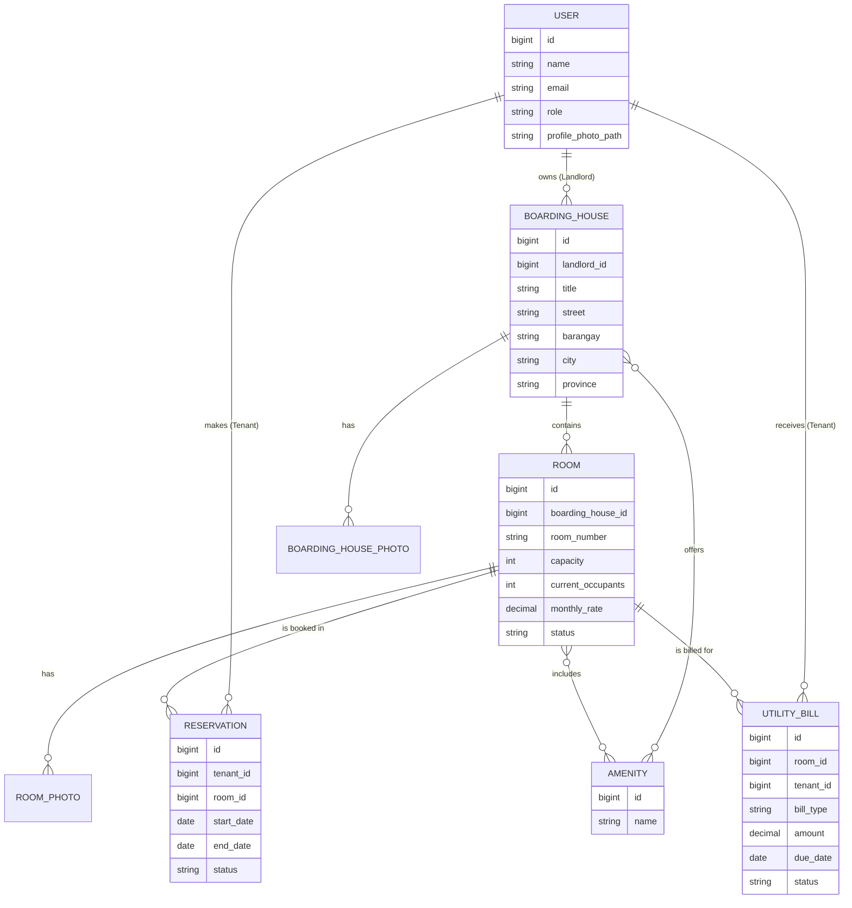

# Boarding Hub User Manual
## Quality Stay – Simplified

Welcome to **Boarding Hub**, the premium platform for managing and finding quality boarding house stays. This manual provides a comprehensive guide for all users of the system.

---

## 📋 Table of Contents
1. [General Overview](#general-overview)
2. [Tenant Guide](#tenant-guide)
3. [Landlord Guide](#landlord-guide)
4. [Super Admin Guide](#super-admin-guide)
5. [Database Architecture (ERD)](#database-architecture-erd)
6. [Common Features](#common-features)
7. [Legal & Schema](DATABASE_SCHEMA.md)

---

## 🏛️ General Overview
Boarding Hub is designed to bridge the gap between property owners (Landlords) and individuals seeking accommodation (Tenants). The system features a modern "Boarding Hub Pink" aesthetic and a streamlined user interface.

### Platform Motto: "Quality Stay"

---

## 🏠 Tenant Guide
As a tenant, your journey begins with finding the perfect room.

### 1. Finding a Boarding House
- Navigate to **"Find a Boarding House"** in the sidebar.
- Use the **Sticky Filter Sidebar** on the left to narrow down your search by:
    - **Location**: Search for specific streets, barangays, or cities.
    - **Budget**: Filter by monthly rate ranges.
    - **Amenities**: Select specific features like WiFi, Aircon, etc.

### 2. Requesting a Reservation
- Click **"View Details"** on any property card.
- Select an available room and click **"Reserve Now"**.
- Provide your **Stay Start Date** and optional **Expected End Date**.
- Submit the request for the landlord's review.

### 3. Managing Reservations
- View your requests in **"My Reservations"**.
- You can **Modify** or **Cancel** a request as long as it is still "Pending".

### 4. Billing & Notices
- Access **"Billing"** to see utility bills issued by your landlord.
- Unseen bills are highlighted with a notification badge in the sidebar.

---

## 🔑 Landlord Guide
Landlords manage the supply side of the platform.

### 1. Listing Properties
- Navigate to **"My Boarding Houses"**.
- Add a new Boarding House with a title, description, photos, and address.
- Inside each property, you can add multiple **Rooms** with specific capacities, rates, and amenities.

### 2. Reservation Management
- Go to **"Reservations"** to see incoming requests.
- You can **Approve** or **Reject** pending tenant applications.
- Once approved, the room's occupancy status is automatically updated.

### 3. Tenant Management
- View all current stayers in the **"Active Tenants"** section.
- You can see which rooms they occupy and their stay period.

### 4. Issuing Bills
- Go to **"Billing Notices"** to create utility bills for your rooms.
- Specify the bill type (Electricity, Water, etc.), amount, and due date.
- Mark bills as **"Paid"** once the tenant settles them.

---

## 🛡️ Super Admin Guide
Super Admins oversee the entire platform ecosystem.

### 1. Global Dashboard
- View **Registration Trends** over the last 6 months.
- Monitor **Reservation Status Distributions** via visual charts.
- Track total counts for Super Admins, Landlords, Tenants, and Boarding Houses.

### 2. User Management
- Manage all registered **Landlords** and **Tenants**.
- **Edit User Profiles**: Update names, emails, and passwords.
- **Account Control**: Delete users who violate platform policies.

---

## 📊 Database Architecture (ERD)
The following diagram illustrates the relationship between the core entities in the Boarding Hub system.

---

## ⚙️ Common Features
### Profile Management
- All users can update their profile information and security settings via the **Profile** link in the bottom sidebar.

### Responsive Design
- Boarding Hub is fully responsive. You can manage your properties or browse stays from your desktop, tablet, or smartphone.

---
*Generated by Boarding Hub Technical Support*
